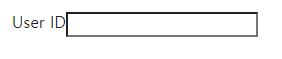

# 폼이란?

* <b>폼(Form)</b>이란 사용자가 정보를 입력, 선택할 때 사용되는 태그이다.  

* HTML에서 Form은 <b>사용자가 웹사이트에 데이터를 전송</b>하는 것을 허용한다.  

* HTML 폼은 하나 이상의 위젯들로 형성될 수 있으며, 이러한 위젯들은 텍스트 필드, 셀렉트 박스, 버튼, 체크 박스, 라디오 버튼 등이 있다.  
  * 위젯(widget) : 컴퓨터 프로그래밍에서 사용자가 웹 사이트 및 어플리케이션과 상호작용을 하기 위한 인터페이스 요소. 위젯들을 사용하여 그래픽 사용자 인터페이스(Graphical User Interface, GUI)를 만들 수 있다.

* 사용자 경험(UX) 관점에서 폼이 적을수록 좋기 때문에 필요한 경우에 사용


# `<form>`  

기본적으로 `<form>`의 형태는 다음과 같다.  
```html
<form action="/my-form-page" method="post">

</form>
```  
폼 사용 시 **폼 안에 다른 폼을 중첩하면 안된다!**

## `<form>`과 관련된 HTML 태그  

  

## `<form>`과 관련된 태그의 속성

  
  
  

### `<fieldset>`

* `<fieldset>` 태그는 폼 필드 세트(form field set)를 표시한다.  

* 폼 필드 세트란 폼 내에서 관련 있는 위젯들을 하나의 그룹으로 지정하는 것을 의미한다.  

* 폼 필드 세트를 사용하면 폼을 효과적으로 계층화 활 수 있다는 장점이 있다.  

* `<fieldset>`영역에 테두리 선이 생긴다.  

### `<legend>` 

`<legend>`태그는 `<fiedlset>` 요소의 **제목을 표시**할 때 사용한다.  
```html
<form>
  <fieldset>
  <legend>음료 사이즈</legend>
  <p>
    <input type="radio" name="size" id="size_1" value="small">
    <label for="size_1">Small</label>
  </p>
  <p>
    <input type="radio" name="size" id="size_2" value="medium">
    <label for="size_2">Medium</label>
  </p>
  <p>
    <input type="radio" name="size" id="size_3" value="large">
    <label for="size_3">Large</label>
  </p>
  </fieldset>
</form>
```


### `<label>` 

`<label>` 태그는 위젯의 제목이나 이름을 표시한다.  
랙 속성 값에 결합하고자 하는 요소의 id 속성 값을 입력하여 다른 요소와 결합할 수 있다.  
```html
<label for="userID">User ID</label>
<input type="text" name="id" id="userID">
```
  

### `<input>`

`<input>` 태그는 사용자로부터 입력을 받을 수 있는 입력 필드를 표시할 때 사용한다.  <br>
**type 속성 값**을 달리함으로 여러가지 컨트롤을 표시할 수 있다.  <br>
`<input>`의 type 종류와 설명은 다음 [링크](https://developer.mozilla.org/ko/docs/Web/HTML/Element/Input)에 설명되어 있다.
```html
<ul>
  <li>
    <label for="button">button</label>
    <input type="button" id="button" value="button">
  </li>
  <li>
    <label for="checkbox">checkbox</label>
    <input type="checkbox" id="checkbox">
  </li>
  <li>
    <label for="color">color</label>
    <input type="color" id="color">
  </li>
</ul>
```
  

### `<textarea>`   

`<textarea>` 태그는 상요자가 여거 줄의 텍스트를 입력할 수 있는 텍스트 입력 영역을 표시할 때 사용한다.  
```html
<textarea name="opinion" cols="30" rows="3"></textarea>
```  
* `<input>`과 `<textarea>`의 차이는 `<input>`은 자동 닫힘 태그이고, `<textarea>`는 닫는 태그 안에 내용을 입력 해야한다.  

### `<button>`

`<button>` 태그는 클릭할 수 있는 버튼을 표시할 때 사용한다.  
`<button>` 요소 안에는 텍스트나 이미지와 같은 콘텐츠를 삽입할 수 있다.
```html
<button type="button" onclick="alert('Hello World!')">클릭해 보세요!</button>
```  

* `<button>`요소 역시 type을 지정해 수행하는 동작을 설정할 수 있다.  
  * submit : 폼 데이터를 `<form>` 요소의 action 속성에 정의된 웹페이지로 전송한다.
  * reset : 모든 폼 위젯을 기본 값으로 바꾼다.  
  * button : 기본 행동이 없으며, 클릭했을 때 아무것도 하지 않는다.  

* `<input>` 역시 `type='button`을 지정하여 버튼 유형을 만들 수 있다. `<input>`은 일반 텍스트만 보내는 반면, `<button>`은 HTML 전체 콘텐츠를 보내는 차이가 있다.  


# 유효성 검사란?

**유효성 검사(Validation)**란 사용자가 입력한 데이터가 설정한 제약 조건 내에 있는 올바른 형식인지 확인하는 것이다. 즉 데이터가 서버 혹은 데이터 베이스에 저장되기 전 해당 데터를 검증하는 작업이다.
<br><br>
유효성 검사가 필요한 이유는 세 가지이다.  
1. 올바른 형식으로 작성된 올바른 데이터 필요
2. 사용자의 데이터를 호보(ex: 비밀번호에서 대문자, 소문자, 특수문자 조합 등)
3. 악의적은 사용자로부터 보호
<br><br>

유효성 검사는 클라이언트 브라우저 또는 서버에서 이를 검증하게 된다.  
이 때 클라이언트 브라우저에서 수행되는 유효성 검사를 **클라이언트 측 유효성 검사**라 하며, 서버에서 수행되는 유효성 검사를 **서버 측 유효성 검사**라 한다.  
<br><br>

# 클라이언트 측 유효성 검사 

클라이언트 측 유효성 감사는 크게 두 가지 유형으로 구분한다.  
* 기본 제공 약식 유효성 검사(Built-in Form Validation)
* 자바스크립트 유효성 검사(JavaScriptValidation)

클라이언트 측 유효성 검사는 사용자에게 더 나은 UI/UX를 제공할 수 있으며, 서버 부담으 덜어준다는 장점이 있다.  
그러나 다음과 같은 상황에서 문제가 발생할 수 있기 때문에 **100% 신뢰하면 안된다.**  

* 사용자가 브라우저에서 자바스크립트를 끌 경우
* 페이지의 자바스크립트 오류가 발생할 경우
* 악의적인 사용자가 사이트를 통하지 않고 데이터를 전달할 경우  

보다 안전하게 사용자 데이터를 검사하기 위해 항상 서버 측 유효성 검사를 사용하며, 클라이언트 측 유요성 검사를 UX 향상을 위해 추가적으로 사용하는 것이 좋다.  
<br><br>

## 기본 제공 양식 유효성 검사(Built-in Form Validation)

* 기본 제공 양식 유효성 검사는 HTML을 사용하여 유효성 검사 기능을 사용하는 것이다.
* 자바스크립트에 의존하지 않고 검증할 수 있으며 HTML 요소의 유효성 검사 속성을 사용하여 수행

유효성 검사르 위해 사용되는 주요 **HTML 검증 속성들(Validation Attributes)**  
* required : 양식을 제출하기 전에 양식 필드를 채워야 하는지 여부를 지정
* minlength & maxlength : 텍스트 데이터(문자열)의 최소 및 최대 길이를 지정
* min & max : 숫자 입력 유형의 최소값 및 최대값 지정
* type : 데이터가 숫자, 이메일 주소 또는 기타 특정 유형 여부 지정
* pattern : 입력된 데이터가 따라야 하는 패턴을 정의하는 <b>정규 표현식(regular expression)</b> 지정  
    * 정규 표현식(regular expression) : 텍스트 문자열의 문자 조합을 일치시키는데 사용할 수 있는 패턴. [링크](https://regexlib.com/(X(1)A(xbq6hFJi8VMf7gTEdcJd7KSFBchcprDWyTh_tR5Nb4TKD5_uV09k5Sd-53ExYjC6Pqeon5wzbNAVr_fM3vUCTddDrpgMZohDVdjsAVMhVWqr1QiqchFaCfaZu6RJuhd9h3_teSQtmexwqur0mvJDQEutzsidUNE2UOJ3uS1LpV3aWO7wFuvdUxtTTju8Dt4o0))/CheatSheet.aspx)
    ```html
    <input patter="정규 표현식">
    ```
<br>

### CSS 의사 클래스(CSS Pseudo Class)

CSS 의사 클래스란 선택하고자 하는 HTML 요소의 특별한 **상태(State)**를 명시할 때 사용한다.  
유효성 검사에서 자주 사용되는 CSS 가상 클래스  
* :required - required 속성을 가지는 input 요소를 모두 선택
* :optional - required 속성을 가지지 않는 input 요소를 모두 선택
* :valid - 유효한 값을 가지는 input 요소를 모두 선택
* :invalid - 유효하지 않은 값을 가지는 input 요소를 모두 선택  

예제  
**HTML**
```html
<form>
  <label for="nickname">닉네임을 입력해 주세요.(required)</label>
  <input id="nickname" name="myNickname" required>
  <button>제출</button>
</form>
```
**CSS**  
```css
input:invalid {
  border: 2px dashed red;
}

input:invalid:required {
  background-color: red;
}

input:valid {
  border: 2px solid black;
}
```

### 자바스크립트 유효성 검사(JavaScript Form Validation)

자바스크립트를 활용하여 유효성 검사를 하는 이유는 다음과 같다.  
* 기본 오류 메시지 대신 다른 오류 메시지를 사용할 때
* 기본 제공 양식 유효성 검사를 지원하지 않는 일부 구 버전 브라우저에서 처리를 해야할 때
* 보다 정교한 유효성 검사가 필요할 때 
<br>

자바스크립트 유효성 검사의 중요한 점은 **`<button>` 요소의 type 속성 값을 submit으로 하지 않는다는 것**이다.  

## 서버 측 유효성 검사  

서버 측 유효성 검사는 사용자에게 전달받은 데이터를 서버에서 적합한 데이터인지 판별하는 유효성 검사이다.  <br><br>
서버 측 유효성 검사를 사용하는 가장 큰 이유는 사용자가 클라이언트 측 유효성 검사를 우회/조작 할 수 있다는 점이다.